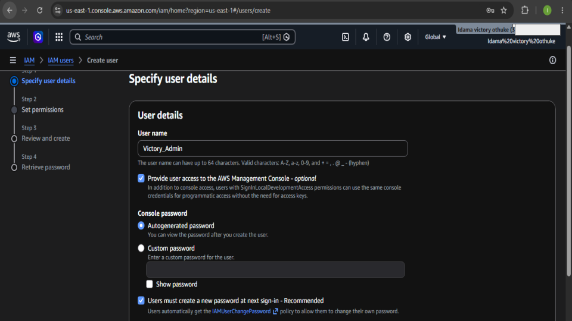
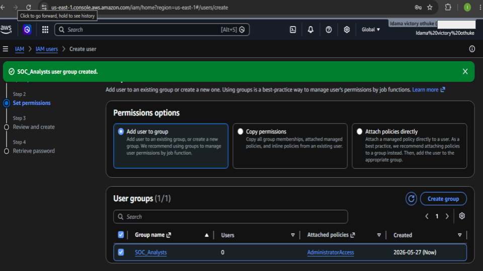
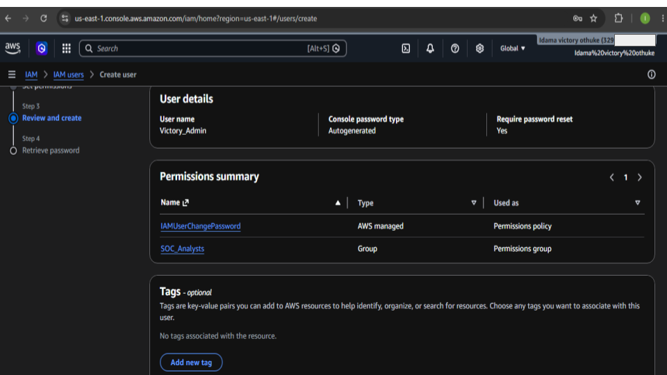
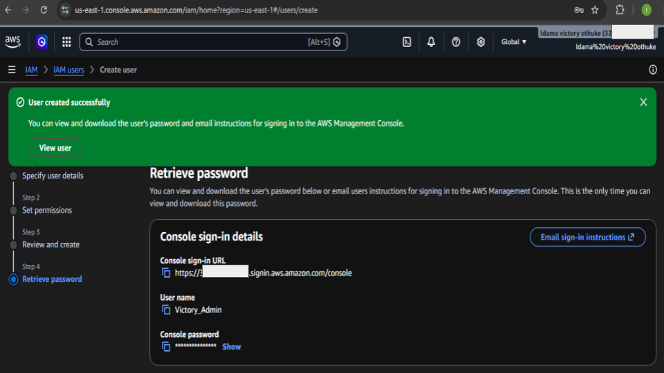
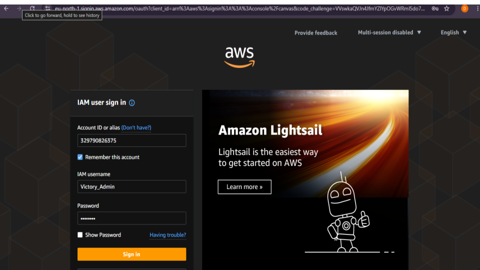
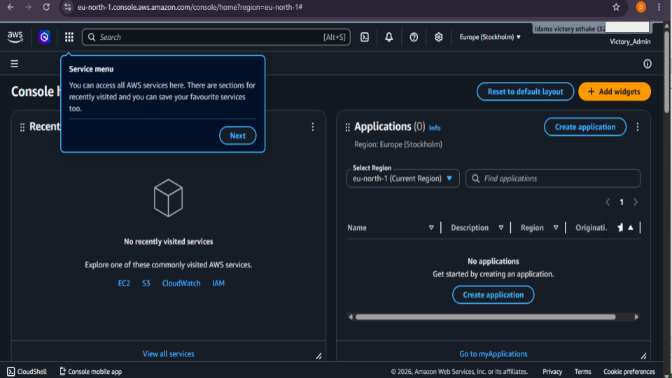
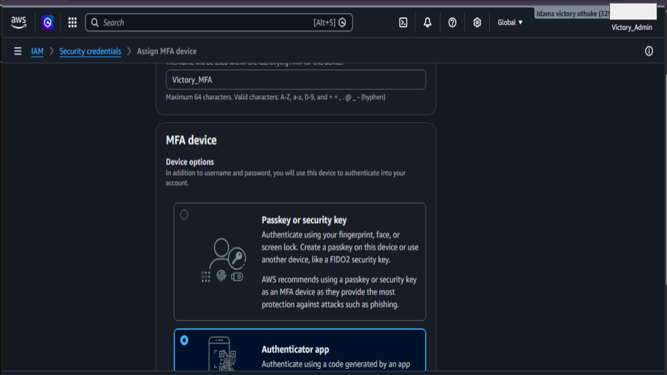
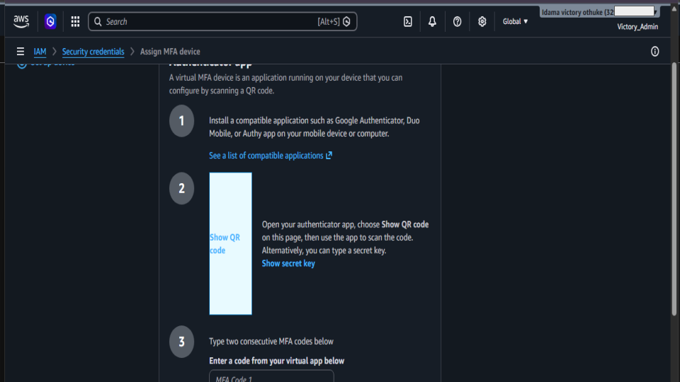
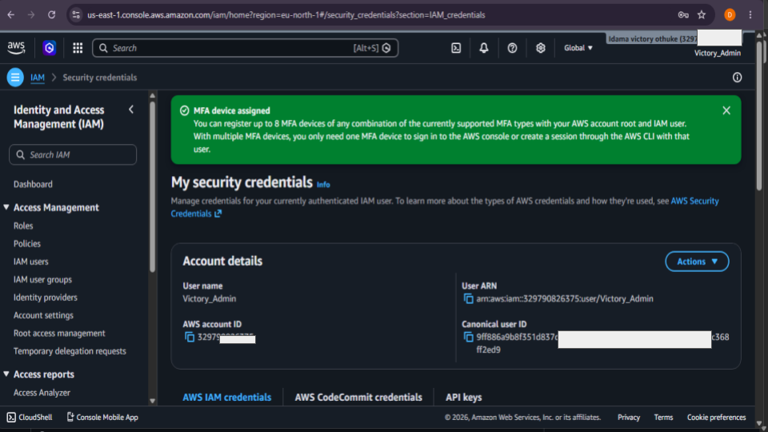

# AWS IAM Security Lab

## Project Overview
This project demonstrates the implementation of AWS Identity and Access Management (IAM) security best practices. The lab focuses on creating IAM users, assigning permissions through groups, and securing accounts with Multi-Factor Authentication (MFA).

---

## Objectives
- Create IAM users
- Configure IAM groups
- Assign AdministratorAccess permissions
- Enforce password reset policies
- Configure MFA security
- Test secure AWS console access

---

## Technologies Used
- AWS IAM
- AWS Management Console
- Google Authenticator

---

## Lab Steps
1. Created IAM user account
2. Created SOC_Analysts user group
3. Assigned AdministratorAccess policy
4. Configured autogenerated password
5. Enabled password reset requirement
6. Tested IAM user login
7. Configured MFA authentication
8. Verified successful secure login

---

## Security Best Practices Applied
- Principle of least privilege using groups
- MFA enforcement
- Password rotation requirement
- IAM-based access management

---

# Skills Gained
- AWS IAM Administration
- User and Group Management
- Cloud Security Fundamentals
- MFA Configuration
- Identity Security Implementation
- Access Control Management
- AWS Console Navigation

---

### 📊 Evidence 

<h4 align="center">In this step, I created a new IAM user named Victory_Admin within AWS Identity and Access Management (IAM).</h4>

    

<h4 align="center">In this step, I configured permissions for the newly created IAM user by adding the user to a security group called SOC_Analysts</h4>

    

<h4 align="center">In this step, I reviewed the IAM user configuration before finalizing the account creation process.</h4>

    

<h4 align="center">In this step, the IAM user account was successfully created within AWS Identity and Access Management (IAM)</h4>

    

<h4 align="center">In this step, I tested the newly created IAM administrator account by signing into the AWS Management Console using the IAM user credentials.</h4>

    

<h4 align="center">In this step, I successfully tested the newly created IAM user account by signing into the AWS Management Console using the IAM user credentials instead of the root account.</h4>

    

<h4 align="center">In this step, I configured Multi-Factor Authentication (MFA) for the IAM user account to improve account security.</h4>

    

<h4 align="center">In this step, I connected the AWS IAM user account to a virtual MFA device using an authenticator application</h4>

    

<h4 align="center">In this step, the Multi-Factor Authentication (MFA) configuration was successfully completed for the IAM user account Victory_Admin.</h4>

    

All screenshots are here:

🔗 [Google Slides](https://docs.google.com/presentation/d/1QlNZg1qEzh7orqzBG582w-p1aUDkw7tJL6X-gUzfTHI/edit?usp=sharing)

> Note: Sensitive account information was blurred for security purposes before publication.

---

# Outcome
Successfully implemented secure AWS IAM user management by:
- Creating IAM users and groups
- Assigning administrative permissions securely
- Enabling MFA protection
- Verifying secure AWS console access
- Applying cloud security best practices in a real AWS environment

---

# Author
## Idama Victory Othuke
SOC Analyst | Cybersecurity Enthusiast

- GitHub: https://github.com/idamacybersecurity
- LinkedIn: https://linkedin.com/in/idama-victory

---
